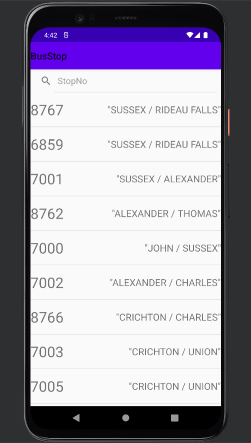
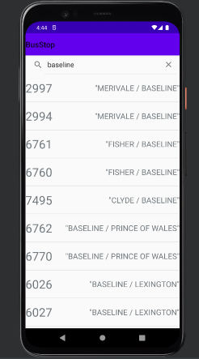
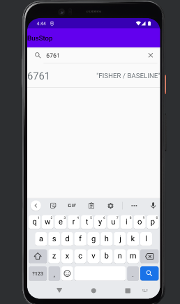
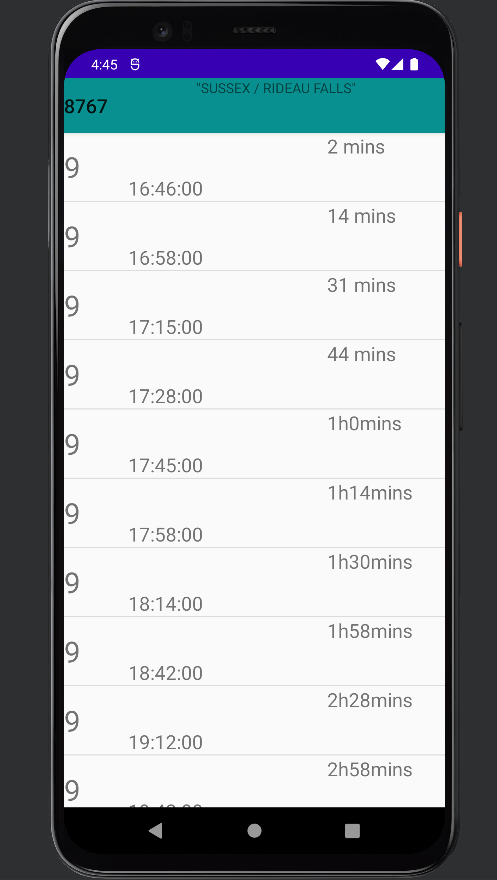

## Bus Stop Application

---

### Table of Contents

- [Description](#description)
- [Installation](#installation)
- [ScreenShots](#screenshots)
- [References](#references)

---

## Description

This application is Android base. It show all the bus stops in ottawa and bus shedule both live and scheduled. There is no data collected and all the data is store on user's device. 

#### Technologies

- OCtranspo API
- GPS
- SQL

[Back To The Top](#bus-stop-application)

---

## Installation
You will need a phycial device to scan real time nearby ble devices. There is no need do change anything before installing i.e. this application can be installed on all the android devices. After installing Application, it would ask you for location permission, it is upto you as app will still run if no permission is given.

---

## ScreenShots

Main screen
This is default i.e. if you don't give the permission you will see this screen but if you provide the permission than it will so stops base on yuor location from nearest to furtherest.

Name base search 

Bus Stop Number base search

It show all the buses that are shedule and thier time. If internet permission is given then it will give you gps time of the bus from OCtranspo API

## References
https://www.octranspo.com/en/plan-your-trip/travel-tools/developers/dev-doc/

[Back To The Top](#bus-stop-application)
